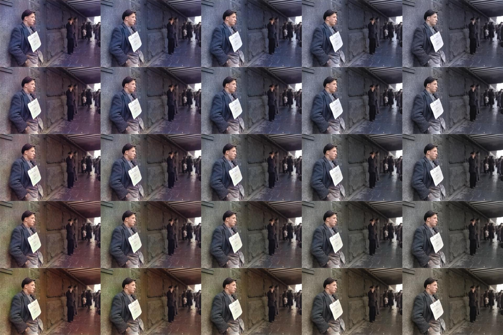

# EECS442 21WN Course Project: Color-VAE




### Environment setup 

Please install [survae](https://github.com/didriknielsen/survae_flows) first
```bash
pip install git+https://github.com/didriknielsen/survae_flows.git
# the install corresponding environment
conda create -n colorvae --file requirements.txt
```

### Downlaod Dataset

1. [COCO](https://cocodataset.org/#home) train2017 & val2017 dataset
    Please extract to `./coco` folder.

2. Tiny imagenet provided on Kaggle
    ```bash
    kaggle datasets download -d akash2sharma/tiny-imagenet
    ```
    Please delete the duplicated folder in the zip file before training 

### Download Pre-trained Model

[[Google Drive](https://drive.google.com/file/d/1ekMTlypp8HeQ9ezGiZuyuxQ4xVdwd7_f/view?usp=sharing)]

### Demo
```bash
python predict.py --resume models/dil256-vae_model.pt --img_path par37351-teaser-story-big.jpg
```

### Train
```bash
python main.py --img_size 256  --dataset COCO --lr 0.001 --exp_name dil256 --batch_size 32
```

### Prediction
1. For image output
```bash
python predict.py --img_size 256 --resume models/dil256-vae_model.pt --img_path coco/val2017 --sample_num 8 --separate
```

2. For image output with VAE hint
```bash
python predict.py --img_size 256 --resume models/dil256-vae_model.pt --img_path coco/val2017 --sample_num 8 --separate --vae_hint
```

3. For PNSR score
```bash
python predict.py --img_size 256 --resume models/dil256-vae_model.pt --img_path coco/val2017 --sample_num 8 --psnr
```


### PSNR

|ColorVAE|Non-VAE|ECCV16|SIGGRAPH17|w/o semantic pre-train|w/ VAE hint|
|:-:|:-:|:-:|:-:|:-:|:-:|
|26.0008|24.6531|21.9863|25.6168|21.5979|27.0091|

### Rating

|Non-VAE|ECCV16|SIGGRAPH17|w/ VAE hint|
|:-:|:-:|:-:|:-:|
|3.555|3.188|3.546|3.691|
